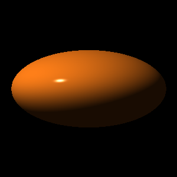
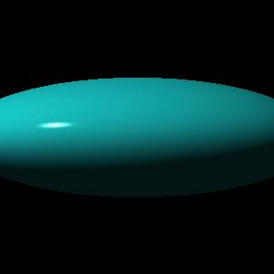
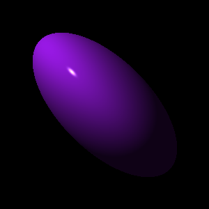
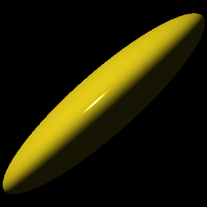
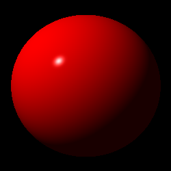
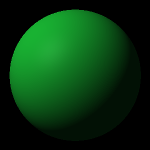

# ray-tracer

[](https://www.python.org/downloads/release/python-3120/)
[](https://opensource.org/licenses/MIT)
[](https://github.com/astral-sh/ruff)
[](https://mypy-lang.org/)
[]()
[](https://app.deepsource.com/gh/taihim/ray-tracer/)

A ray tracer built from scratch in Python, following test-driven development.

## Gallery

### Transforms

| Squashed `scale(1, 0.5, 1)` | Wide ellipsoid `scale(1.5, 0.5, 1)` | Tilted oval `rotate_z(π/4) · scale(0.5, 1, 1)` |
|:---:|:---:|:---:|
|  |  |  |

| Shear `shear(x∝y) · scale(0.5, 1, 1)` | | |
|:---:|:---:|:---:|
|  | | |

### Materials (Phong model)

| Baseline `specular=0.9, shininess=200` | Matte `specular=0.05, shininess=10` | High-gloss `specular=1.0, shininess=400` |
|:---:|:---:|:---:|
|  |  |  |

## Features

- **Tuples & Points** - Custom 3D tuple implementation supporting points (w=1) and vectors (w=0) with full arithmetic operations (add, subtract, negate, dot product, cross product, normalization)
- **Colors** - RGB color representation with Hadamard product for color blending
- **Canvas** - 2D pixel array for rendering with PPM image export
- **Matrices** - 4x4 transformation matrices with multiplication, transposition, determinant, and inversion
- **Transforms** - Translation, scaling, rotation (x/y/z), shearing, and chained transformations
- **Rays** - Ray casting with origin/direction, position calculation, and ray transformation
- **Spheres** - Unit sphere primitives with configurable transforms, ray-sphere intersection testing, and surface normals
- **Materials** - Phong reflection model properties (color, ambient, diffuse, specular, shininess)
- **Lights** - Point light sources with position and intensity
- **Parallel Rendering** - Multiprocessing support for faster image generation

## Project Structure

```
src/
  ray_tracer/
    tuples/         # CustomTuple (points & vectors) and ColorTuple
    canvas/         # Canvas and PPM export
    matrix/         # RTMatrix and Transform classes
    ray/            # Ray and intersection functions
    sphere/         # Sphere primitives and surface normals
    intersection/   # Intersection records
    material/       # Material properties (Phong model)
    lights/         # Point light sources
  cannon/           # Physics simulation (projectile + environment)
scripts/
  draw_sphere.py    # Render a sphere with transforms
  clock.py          # Draw clock face points using rotation transforms
  use_cannon.py     # Projectile simulation
tests/              # Comprehensive test suite (138 tests, 100% coverage)
```

## Setup

Requires Python 3.12.

```bash
# Install dependencies
uv sync

# Run tests
pytest .

# Type checking
mypy .

# Lint
ruff check .

# Render the sphere
python -m scripts.draw_sphere
```

Output images are saved to `images/` in PPM format.
